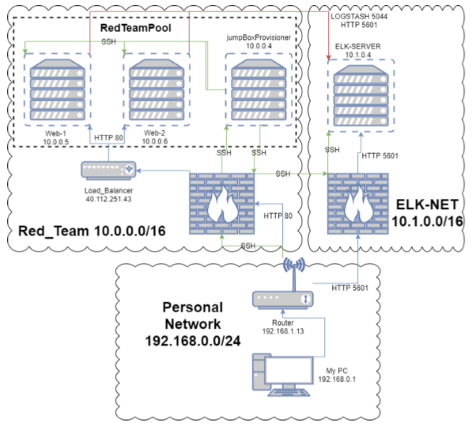

## Automated ELK Stack Deployment

The files in this repository were used to configure the network depicted below.

These files have been tested and used to generate a live ELK deployment on Azure. They can be used to either recreate the entire deployment pictured above. Alternatively, select portions of the YAML file may be used to install only certain pieces of it, such as Filebeat.

This document contains the following details:
- Description of the Topology
- Access Policies
- ELK Configuration
  - Beats in Use
  - Machines Being Monitored
- How to Use the Ansible Build

### Description of the Topology

The main purpose of this network is to expose a load-balanced and monitored instance of DVWA, the D*mn Vulnerable Web Application.

Load balancing ensures that the application will be highly available, in addition to restricting access to the network.
The load balancer distributes the incoming traffic across both web servers. The access controls in place will prevent unathuorized access.

Integrating an ELK server allows users to easily monitor the vulnerable VMs for changes to the log files and system metrics.

The configuration details of each machine may be found below.
| Name               | Function   | IP Address | Operating System |
|--------------------|------------|------------|------------------|
| JumpBoxProvisioner | Gateway    | 10.0.0.4   | Linux            |
| Web 1              | Web Server | 10.0.0.5   | Linux            |
| Web 2              | Web Server | 10.0.0.6   | Linux            |
| ElkServer          | Monitoring | 10.1.0.4   | Linux            |

### Access Policies

The machines on the internal network are not exposed to the public Internet. 

Only the JumpBoxProvisioner machine can accept connections from the Internet. Access to this machine is only allowed from the following IP addresses:
154.21.23.14

Machines within the network can only be accessed by JumpBoxProvisioner.

A summary of the access policies in place can be found in the table below.

| Name               | Publicly Accessible | Allowed IP Addresses |
|--------------------|---------------------|----------------------|
| JumpBoxProvisioner | Yes                 | 154.21.23.14         |
| Web 1              | No                  | 10.0.0.4             |
| Web 2              | No                  | 10.0.0.4             |
| ElkServer          | No                  | 10.0.0.4             |

### Elk Configuration

Ansible was used to automate configuration of the ELK machine. No configuration was performed manually, which is advantageous because Ansible saves time and ensures consistency when setting up multiple machines.

The playbook implements the following tasks:
- Increase the memory availableto the Elk container.
- Install these services: docker.io, python3-pip, and docker.
- Download and run the sebp/elk:761 container.
- Publish these ports when the container starts: 5601:5601, 9200:9200, 5044:5044.

The following screenshot displays the result of running `docker ps` after successfully configuring the ELK instance.

### Target Machines & Beats
This ELK server is configured to monitor the following machines:
- 10.0.0.5
- 10.0.0.6

We have installed the following Beats on these machines:
- Filebeat
- Metricbeat
- Packetbeat

These Beats allow us to collect the following information from each machine:
- Filebeat detects changes in the file system. This implementation is using it to collect Apache logs.
- Metricbeat reports changes in system metrics, such as levels of CPU and RAM usage.
- Packetbeat collects packets that pass through the NIC, allowing us to track all activity on the network.

### Using the Playbook
In order to use the playbook, you will need to have an Ansible control node already configured. Assuming you have such a control node provisioned: 

SSH into the control node and follow the steps below:
- Copy the playbook files to the Ansible Control Node.
- Update the hosts file to include the IP addresses of the target machines.
- Run the playbook, and navigate to Kibana to check that the installation worked as expected.

- filebeat-playbook.yml is the playbook, and the directory it should be copied to in the container is /etc/ansible/
- /etc/ansible/hosts should be edited with the IP addresses of the machines you wish to target. Use different headers in this file for the groups getting different software installed (ELK vs. Filebeat).
- The URL to make sure the installation is running is http://[IP]:5601/app/kibana where IP is the private IP of the Elk server that the provisioner can access.
